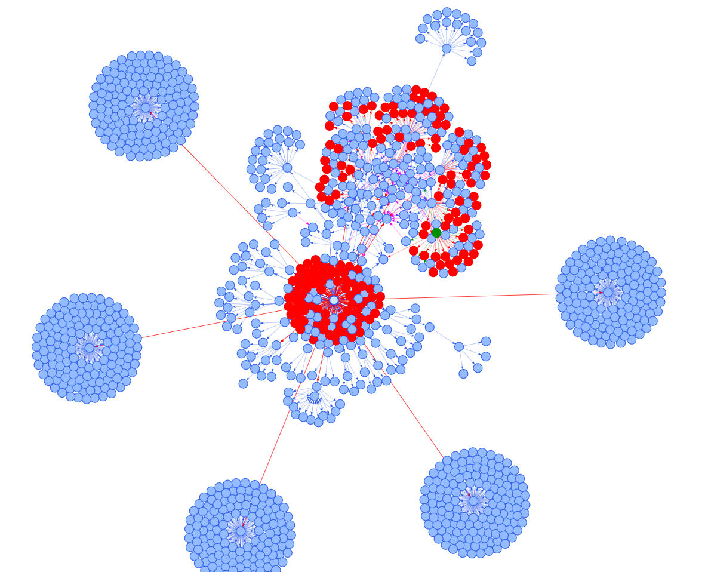

# Pretty inspect

Inspired by the complexity of [Neo](https://github.com/NeuralEnsemble/python-neo).

When browsing/inspecting an object, you want to collect all methods and attributes that match the key.

### Example

Browsing the documentation of `neo.io.BlackrockIO` and looking for the ways of extracting `Epoch`s, you found `read_epoch()` method. But calling this method raises `AssertionError`. You need to go deeper.
1. Run `pip install pinspect neo`
2. Download BlackRock [sampledata.zip](http://www.blackrockmicro.com/wp-content/software/sampledata.zip)

```
wget http://www.blackrockmicro.com/wp-content/software/sampledata.zip
unzip sampledata.zip
```

3. In python,

```python
from neo.io import BlackrockIO
from pinspect import find

session = BlackrockIO('sampleData')
graph = find(session, 'epoch', verbose=True)
```

Output:

```
BlackrockIO.rescale_epoch_duration() -> 'TypeError'
BlackrockIO.read_epoch() -> 'AssertionError'
BlackrockIO._rescale_epoch_duration() -> 'TypeError'
BlackrockIO.read()[0].segments[0].epochs -> 'list of size 0'
BlackrockIO.read()[0].segments[0].events[0].to_epoch() -> 'Epoch'
```

The last two lines are candidates to explore manually.

### Graph visualization

You can pass `visualize=True` and enjoy the beautiful `networkx` with `pyvis` interacting graph rendering.
Hover over the nodes (objects) and edges (methods and attributes) to explore the graph in details and inspect how a particular object has been generated.


#### Unfiltered graph

Below is the full unfiltered graph of `neo.BlackRockIO` of all possible method and attribute calls. Can you find the green dot?



### Requirements

1. Python 3.6+
2. [requirements.txt](requirements.txt)

### Alternative

Another package to inspect python variables is [objbrowser](https://github.com/titusjan/objbrowser).
